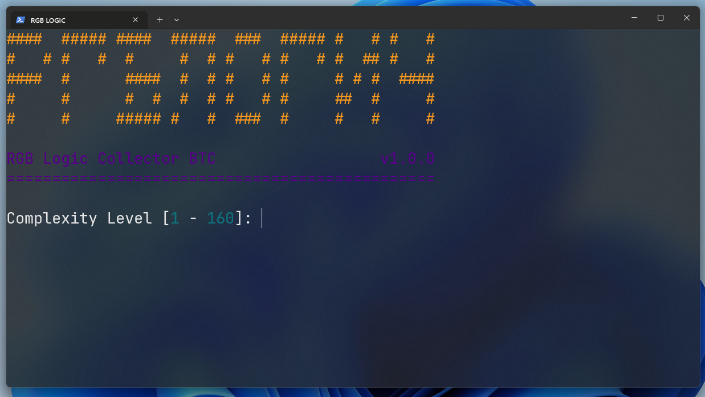
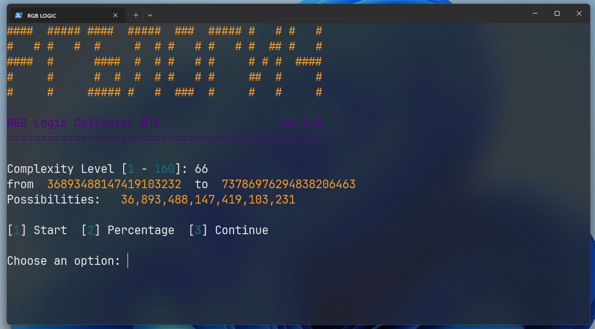
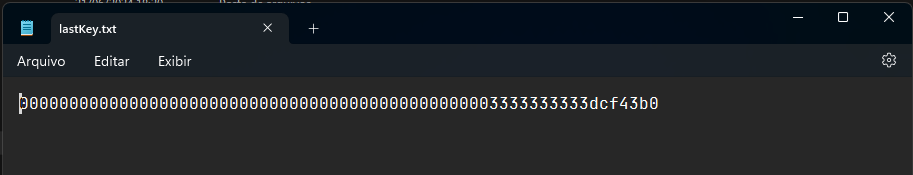
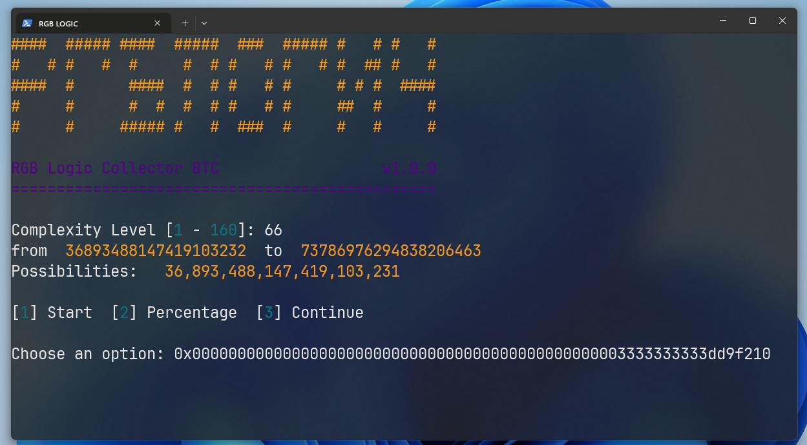
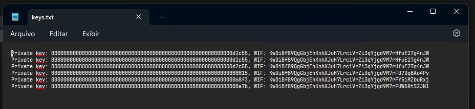
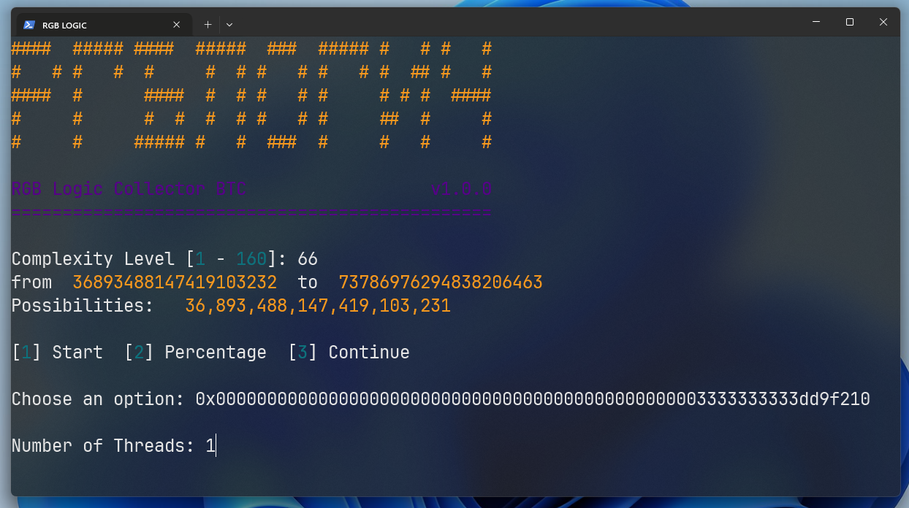

# RGB LOGIC - Script de Busca de Chaves do Puzzle Bitcoin

### Visão Geral
Este aplicativo Node.js busca por chaves privadas de Bitcoin dentro de intervalos especificados, usando processamento paralelo com threads de trabalho do Node.js. Ele fornece monitoramento de progresso em tempo real e registra os resultados em arquivos.

### Instalação
- Instale o Node.js
- Clone o repositório

Use `npm install` para adicionar as bibliotecas 
Use `node index.js` para rodar o projeto

### Instruções
Selecione o Nível de Complexidade do Puzzle (1-160) para definir o intervalo de busca.

### Opções
O Script conta com 3 opções principais, [1] Iniciar Scan do Começo [2] Escolher uma porcentagem Ex: `0.72` e [3] Continuar de uma Chave

### Monitore o Progresso
Veja atualizações em tempo real sobre a velocidade de busca de chaves e progresso.
A cada 10.000 chaves buscadas, um resumo atualiza a velocidade e o progresso atual.

### Interrompa e Retome:
Pressione ` Ctrl + C` para interromper a busca. Para retomar, reinicie o aplicativo e selecione a opção para continuar do último ponto de verificação.

### Continuar
Para continuar de onde parou, você precisa copiar a chave do arquivo `lastKey.txt` e selecionar a opção '3'. 
Você deverá adicionar o prefixo `0x` a sua chave
EX:

### Visualize os Resultados
As chaves privadas de Bitcoin encontradas e seu formato de importação de carteira (WIF) são registradas no arquivo `keys.txt`
Com essa chave no formato WIF, você pode criar uma nova carteira importando os fundos da carteira privada encontrada.

### Multi Thread
O codigo é capaz de gerar uma nova thread para reforçar a busca.

